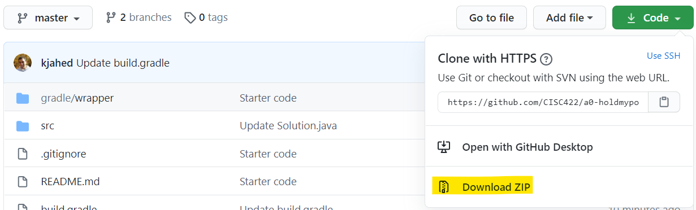
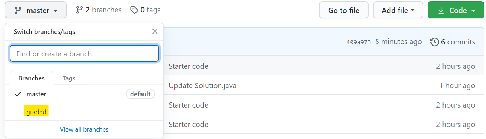

# CISC/CMPE 422: Formal Methods in Software Engineering (Fall 2022)
## Assignment 3: Property-based Testing
## Due date: Friday, Nov 11, 5pm EST (GitHub classroom and OnQ submission)

## Software
This assignment uses Jqwik, an alternative test engine for the JUnit 5 platform that
brings property-based testing (PBT) to Java.
[Jqwik's web site](https://jqwik.net/) contains a detailed, example-based
[user guide](https://jqwik.net/docs/current/user-guide.html), as well as
pointers to introductory material to PBT in general.
The latest version of Jqwik is available in the [Maven Central Repository](https://search.maven.org/search?q=g:net.jqwik)
and the source code can be found on [GitHub](https://github.com/jlink/jqwik).
Both Gradle and Maven provide support for JUnit, and thus also for Jqwik.
The starter code for this assignment contains a `gradle.build` file
suitable building and testing Java applications with Jqwik.


## Learning Outcomes
The purpose of this assignment is to give you
- practical experience with
    - identifying and expressing properties of the input and output of methods, and using these properties for testing and debugging
    - automatic test input generation
- an increased, practical understanding of implementing advanced data structures in Java with generics.

## Provided Starter Code
The provided starter code contains a Java implementation of [AVL trees](https://en.wikipedia.org/wiki/AVL_tree),
a form of balanced binary search tree. The implementation is in class [`AVL<K,V>`](src/main/java/AVLStarter/AVL.java) in package `AVLStarter`
where `K` and `V` are type parameters specifying the types of the keys and values in the tree, respectively.
These parameters make the implementation generic in the sense that the exact same implementation can be used for
AVL trees with different kinds of keys and values (the only restriction is that `K` must extend the interface
`Comparable<K>` which, in effect, imposes a *total order* on the elements in `K`). For instance,
`AVL<Integer,String> avl1;` declares `avl1` to be a reference to an AVL tree
with keys of type `Integer` and values of type `String`. Apart from a constructor and
methods to create an empty tree, check for emptiness, clone a tree, and produce a string representation
of a tree, class `AVL<K,V>` contains a method to [`find`](src/main/java/AVLStarter/AVL.java#L76-L90) a key in a tree, 
[`insert`](src/main/java/AVLStarter/AVL.java#L92-L121) a value under
a key in a tree, and [`delete`](src/main/java/AVLStarter/AVL.java#L123-L168) a key (and the associated value) from a tree. 
Insert and delete use a helper method to [`rebalance`](src/main/java/AVLStarter/AVL.java#L172-L191) the tree, if necessary. 
Methods `delete` and/or `rebalance` are buggy, while you can assume all other methods to be correct.
The final goal of the assignment is to use PBT to locate and fix these bugs.

To help you get started with PBT with Jqwik, the starter code also contains a 
properties file [`AVLProperties.java`](src/test/java/AVLProperties.java).
This file contains a generator for AVL trees, helper methods for implementing relevant properties of AVL trees, and a
couple of simple example-based tests. It also contains a few property-based tests to validate the
generator. **As you can see, the tests only consider AVL trees with keys and values of type `Integer`.
You can make the same assumption throughout this assignment.**

### Running the provided starter code
As for Assignment 1, use your favourite means to clone and create a local copy of this repository.
If you are unfamiliar with GitHub and don't know how to do this, please see the GitHub Classroom Quick Start pages.
Using Git-Bash, the following will clone, build, and run all unit tests in `src/test/java`, including the
example-based and the property-based tests in `AVLProperties.java`.

```
git clone https://github.com/CISC422/<your_repository> a3
cd a3 && ./gradlew test
```

You can run individual tests using an IDE (Eclipse or IntelliJ). But, note you can also use
Gradle's test filtering capabilities. E.g., 
```
./gradlew test --tests AVLProperties.exIsEmpty
```
will run the (example-based) test [`exIsEmpty`](src/test/java/AVLProperties.java#L84-L90) in `AVLProperties` and leave a test 
report in `build/reports/tests/test/index.html`.
```
./gradlew --info test --tests AVLProperties.propGenerator*
```
will run all (property-based) tests starting with `propGenerator` with the log level set to `--info` 
instead of the `--quiet` default which logs errors only. Again,
`build/reports/tests/test/index.html` will contain a test report. 

So, the use of an IDE is not necessary: just use an editor to make changes to ```AVL.java``` and ```AVLProperties.java``` and run the tests from the command line.
<!---
To build a runnable jar file eval.jar with Git-Bash run the Gradle (a build tool) wrapper in directory a3.
```
./gradlew jar
```
-->

## Your Tasks
### Part I: Getting started  [0/80 points]
**Q1 [0 points]:** 
First, run the existing tests in `AVLProperties.java`. You can do this from the command line
(as shown above), or from an IDE, if it supports JUnit (such as Eclipse or IntelliJ).
Ensure that all tests are run and complete successfully, i.e., none of these tests should fail.

### Part II: PBT for insert [12/80 points]
- **Q2a [4 points]:** Assuming that *t* is an instance of `AVL<Integer,Integer>` and that *k* and *v* are instances 
of `Integer`, let *P1(t,k,v)* denote the following property: *"P1(t,k,v): After inserting value v under key k in t 
(i.e., after executing `t.insert(k,v)`), the resulting tree (i.e., the tree returned by `t.insert(k,v)`) stores v under k"*.

   Add an implementation of *P1(t,k,v)* to `AVLProperties.java` in the indicated place.
Your implementation can use any method in class `AVL<K,V>` except `delete` and any of the 
helper methods in `AVLProperties`. Your implementation should use input generation
to allow for *P1(t,k,v)* to be checked automatically for different parameter values as follows:
For *t*, your implementation should use the AVL tree generator provided in `AVLProperties`.
For *k*, customize Jqwik's built-in generator for `Integer` such that it can generate all
keys that the generated trees can contain.
For *v*, customize Jqwik's built-in generator for `Integer` such that it generates either 0 or 1.
Check your implemented property using Jqwik.
Note that this check should be successful, i.e., it should not fail,
regardless of how many inputs are generated and how many tries the
check involves.

- **Q2b [4 points]:** Assuming that *t* and *k* are instances of `AVL<Integer,Integer>` and `Integer`, respectively, 
let *P2(t,k)* denote the following property: *"P2(t,k): After inserting value 0 under key k in t, if t contains k, 
then the insertion does not change the number of nodes of the tree, and if t does not contain k, then the insertion 
increases the number of nodes by exactly 1"*.

   Add an implementation of *P2(t,k)* to `AVLProperties.java` in the indicated place.
Your implementation can use any method in class `AVL<K,V>` except `delete` and any of the
helper methods in `AVLProperties`. Your implementation should use input generation
to allow for *P2(t,k,v)* to be checked automatically for different parameter values as follows:
For *t*, your implementation should use the AVL tree generator provided in `AVLProperties`.
For *k*, customize Jqwik's built-in generator for `Integer` such that it can generate all
keys that the generated trees can contain.
Check your implemented property using Jqwik.
Note that this check should be successful.

- **Q2c [4 points]:** Assuming that *t* and *k* are instances of `AVL<Integer,Integer>` and `Integer`, respectively, 
let *P3(t,k)* denote the following property: *"P3(t,k): After inserting value v under key k in t, if t contains k, 
then the insertion does not change the height of the tree, and if t does not contain k, then the insertion increases 
the height by at most 1"*

   Add an implementation of *P3(t,k)* to `AVLProperties.java` in the indicated place.
Your implementation can use any method in class `AVL<K,V>` except `delete` and any of the 
helper methods in `AVLProperties`. Your implementation should use input generation
to allow for *P3(t,k,v)* to be checked automatically for different parameter values as follows:
For *t*, your implementation should use the AVL tree generator provided in `AVLProperties`.
For *k*, customize Jqwik's built-in generator for `Integer` such that it can generate all
keys that the generated trees can contain.
Check your implemented property using Jqwik.
Note that this check should be successful.

  
### Part III:  PBT for delete [48/80 points]
**Q3 [48 points]:** Identify 4 properties of the delete operation. 
For full marks, these properties should be *correct* (i.e., 
be consistent with the expected behaviour of delete), 
*non-trivial* (i.e., identify a non-obvious 
aspect of delete's expected behaviour), and *non-overlapping*
(i.e., for these four properties, none should be implied
by any of the other).  

Add implementations of these 4 properties to ```AVLProperties.java``` in the indicated places. 
Your implementation can use any of the methods in ```AVL<K,V>``` and any of the helper
methods (including new helper methods implemented by you) in ```AVLProperties.java```. 

For each of these 4 implementations, 
1. add an informal, yet correct and precise description of the property (similar to the descriptions of properties P1, P2, and P3 in Part II) in a comment, 
2. check the property on the original starter code and indicate whether or not it succeeds or fails on the starter code, and
3. check the property on the corrected code (i.e., the code after your fixes from Part IV have been applied) and indicate whether or not it succeeds or fails on the corrected code, and

For full marks, all four properties should fail on the starter code, and succeed on the corrected code you create as part of Part IV below. 

### Part IV: Using PBT for debugging [20/80 points]
**Q4 [20 points]:** Use the 4 properties from Part III and possibly additional properties or examples (all put in the indicated 
places in ```AVLProperties.java```) to locate and correct the bugs in ```delete``` and/or ```rebalance```. 
Collectively, these two methods contain at least 2 and at most 4 bugs in total. 

A *bug* will either be an 
*incorrect content bug* (i.e., a single line of code whose content is incorrect), or 
an *incorrect location bug* (i.e., a single line of code that is in the wrong place). 

For each bug, devise a fix that will correct the bug.
For incorrect content bugs, a fix is the replacement of the incorrect content by correct content, 
and a description of the fix is an indication of the line with incorrect 
content and what new content the incorrect content needs to be replaced with. 
For incorrect location bugs, a fix is the move of the out-of-place line of code to its correct
location, and a description of the fix is an indication of which line of code is out-of-place
and where it needs to be moved to. 

File ```AVLCorrected\AVL.java``` is a copy of ```AVLStarter\AVL.java```. **For each bug, 
implement the fix in ```AVLCorrected\AVL.java``` (and leave ```AVLStarter\AVL.java``` unchanged).** 
Use comments to describe the fix. E.g., let the following be an incorrect content bug in the code
```
   x = x/2;
```  
Then, the following would constitute an appropriate description of the fix in your corrected version of the code:
```
// x = x/2;   // bug n: incorrect content
   x = x/3;   // fix of bug n: correct content
```  
where ```n``` is a number between 1 and 4 identifying the bug uniquely. 
Similarly, in the code below, assume that the assignment `x = x/2;` is in the wrong location: 
```
   int x=0;
   x = x/2;   
   x = 42;
   y = x;
```   
Then, the following would constitute an appropriate description of the fix in your corrected version of the code:
```
   int x=0;
// x = x/2;   // bug n: incorrect location
   x = 42;
   x = x/2;   // fix of bug n: correct location
   y = x;
```
Note that your description should **disable the bugs and enable your fixes**. 
Ideally, the resulting version of the `delete` and `rebalance` methods should 
compile, be completely correct and pass all of your (and our) tests. 
To have the tests run on your corrected version in `AVLCorrected\AVL.java` instead 
of the starter code in `AVLStarter\AVL.java`, just change the import at 
the top of `AVLProperties.java`:
```
import AVLStarter.AVL;
// import AVLCorrected.AVL;
```

## Additional Instructions
**Important: ignoring the instructions below may reduce your grade!**

- You may only change the contents of ```src\test\java\AVLProperties.java```, ```src\main\java\AVLCorrected\AVL.java```, and ```src\test\resources\junit-platform.properties``` (to change the number of tries)
- When you edit ```AVLProperties.java``` make sure that helper methods, examples, and properties are put into the indicated sections of the file
- When you add properties to ```AVLProperties.java``` use the templates to ensure that your answers are in the right place and have the correct format

## What and how to submit
Just like for the previous assignments, submit your assignment before the deadline to GitHub **and** OnQ.
For the OnQ submission, download an archive of your repository from GitHub and upload it **as is** to OnQ. 
**Only submissions present on both GitHub and OnQ will be graded.**



## After the deadline

You access to the repository will be revoked until after the assignment is graded. 
Once the grading is complete, a new branch `graded` will be pushed to your repository 
containing your feedback in PDF format (`feedback.pdf`) format. The feedback file 
will also be published to OnQ.

You can switch to the `graded` branch on GitHub by selecting it from the branches drop 
down menu, e.g.,

